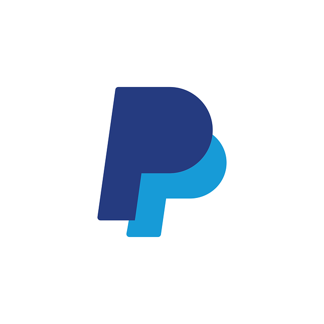

<h3 align="left">Soy Ricardo Vega G</h3>

###

  
  
  
  

###

<h3 align="left">👩‍💻  Sobre mi</h3>

###

Soy un joven de 17 años apasionado por la programación desde una edad muy temprana. Mi objetivo es crear métodos y soluciones que faciliten la vida cotidiana.  Disfruto mucho del trabajo en equipo, y encuentro inspiración y energía en una buena taza de café ☕. Mis comidas favoritas son las hamburguesas 🍔 y las galletas de avena 🍪.

###

<h3 align="left">🛠 Lenguajes y Herramientas</h3>

###

  

###

<h3 align="left">🔥   Mis estadisticas</h3>

  

###

<h3 align="left">💰  Apoyarme</h3>

  
  

###
