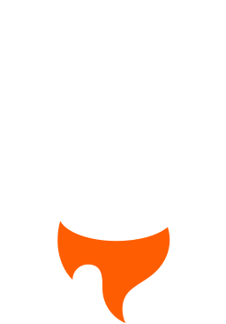
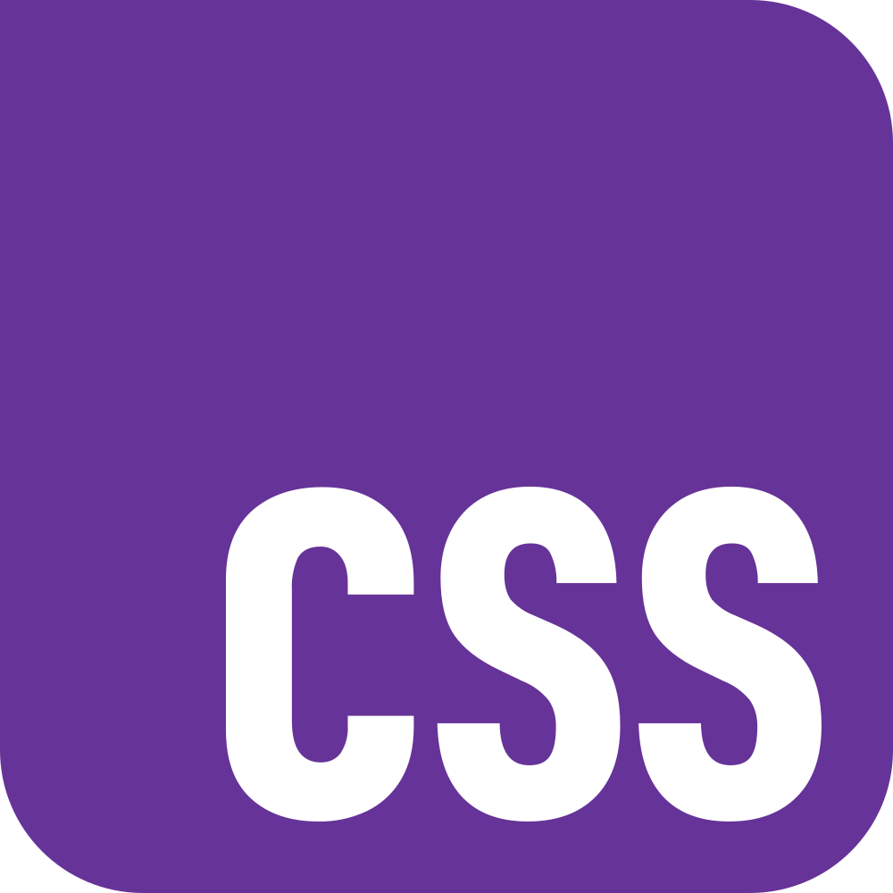
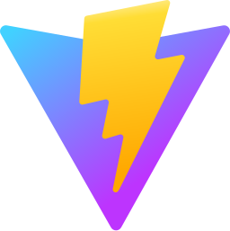
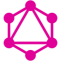
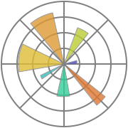
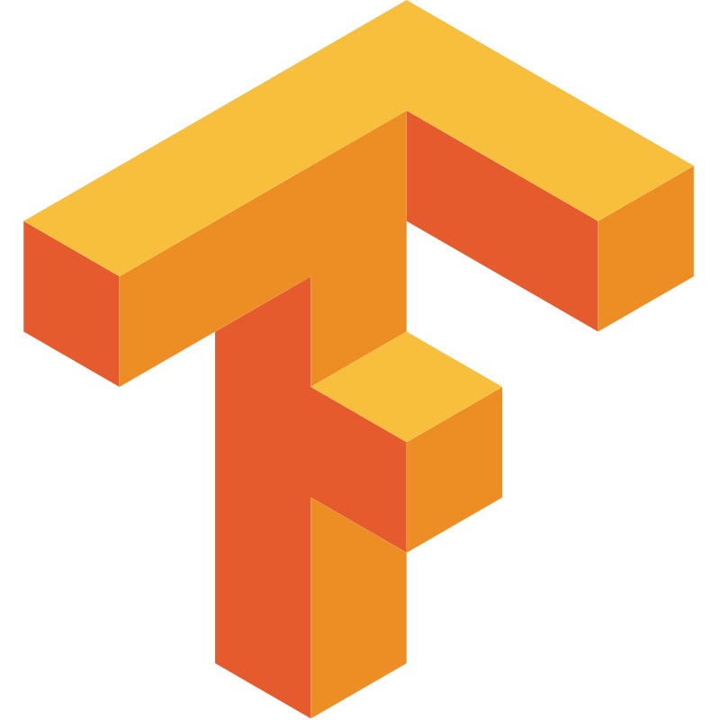
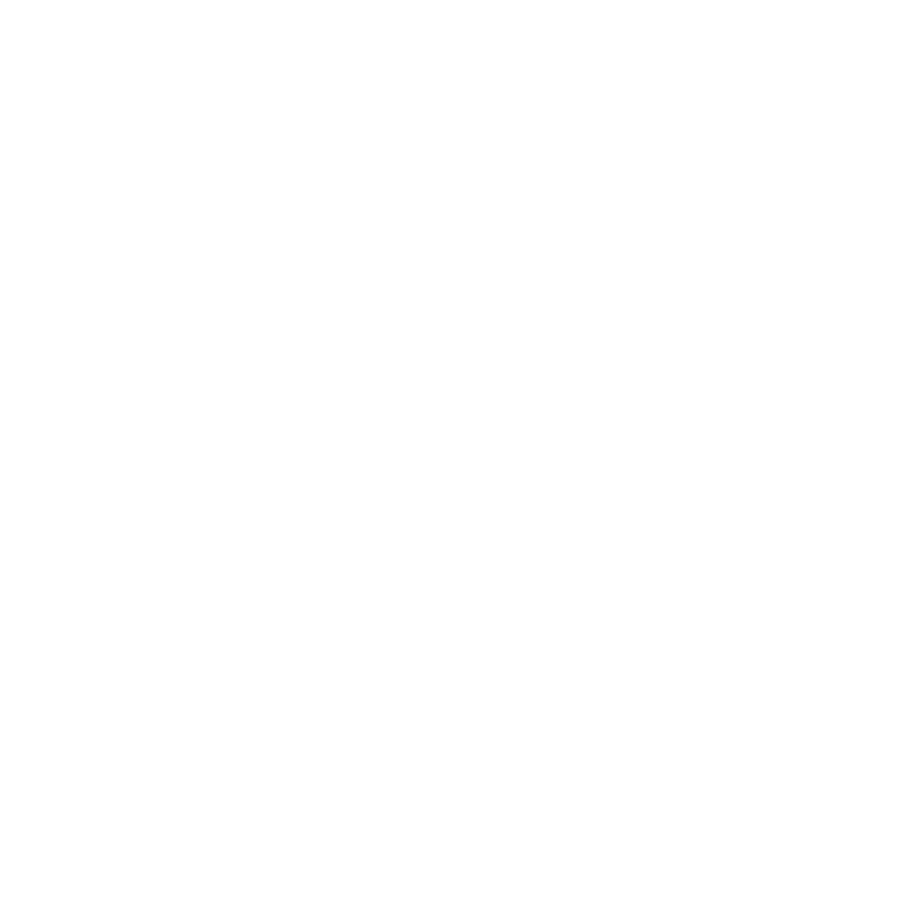
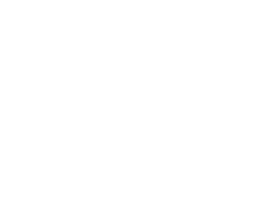

<h1 align="left">Hola soy 👋🏻 Ricardo Vega G</h1>

Me llamo Ricardo Jeshua, pero me conocen como Rick. Empecé en el mundo de la programación a los 13 años, en una Chromebook, y desde entonces he estado aprendiendo y creciendo en este campo.  Tengo 4 años de experiencia desarrollando tanto aplicaciones web como programas de automatización. He trabajado con una variedad de tecnologías; mi lenguaje favorito es TypeScript.  Mi objetivo es crear métodos y soluciones que faciliten la vida cotidiana con la ayuda de la tecnología. Me apasiona aprender y mejorar constantemente, y disfruto compartiendo mis conocimientos con los demás.

<h2 align="left">Frontend</h2>

  
  
  
  
  
  
  
  
  
  
  
  
  
  
  
  
  
  
  
  
  
  
  

<h2 align="left">Backend</h2>

  
  
  
  
  
  
  
  
  
  
  
  
  
  
  

<h2 align="left">Análisis de datos</h2>

  
  
  
  
  
  
  
  
  
  
  

<h2 align="left">Herramientas</h2>

  
  
  
  
  
  
  
  
  
  
  
  
  
  
  
  
  
  
  
  
  
  
  
  
  
  
  

<h2 align="left">Trofeos</h2>

<h2 align="left">Certificados</h2>

  
  
  
  
  

<h2 align="left">Redes sociales</h2>

  
  
  
  

